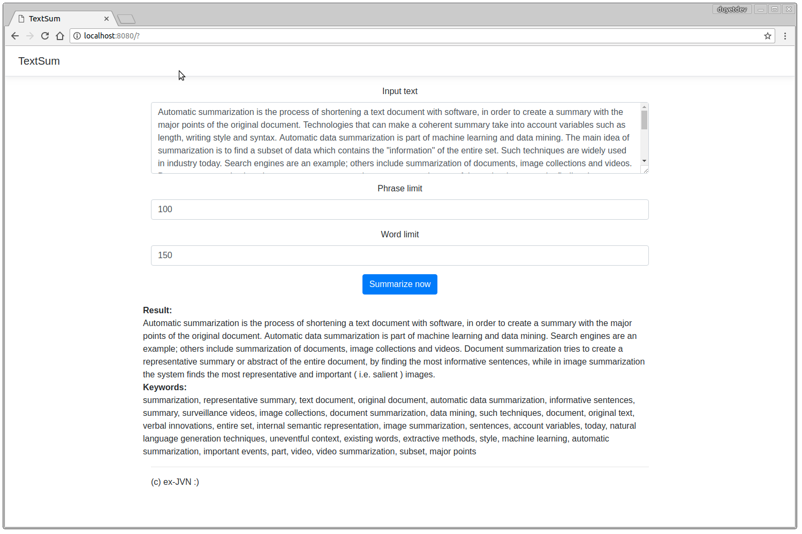

# TextSum

ex-JVN team

# Usage

Please using `Python 3`

```python
from summarize import summarize

text = "Some text here"
result, phrases = summarize(text, phrase_limit=12, word_limit=150)
```

# Start the Web UI

Install the packages
```
pip install -r requirement.txt
```

After installation you need to download a language model:
```
python -m spacy download en
```

Start the server
```
python app.py

```

--------

